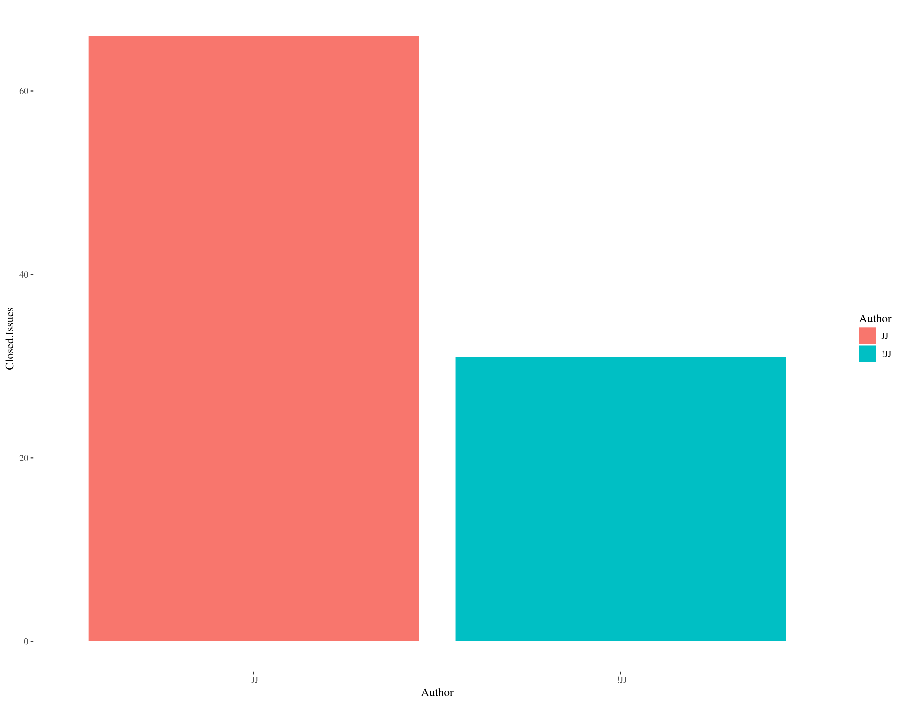
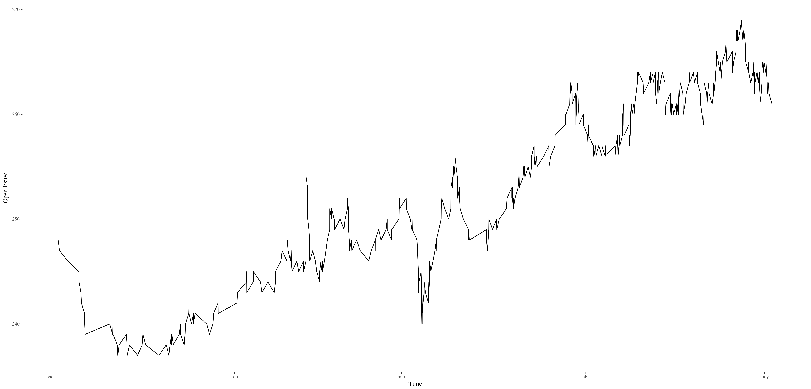
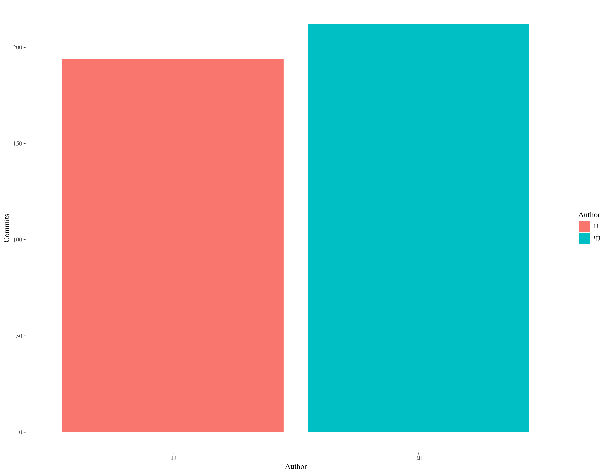

# April, 2018. First grant month

We will set as the official beginning of the grant April 1st, 2018,
which was a Sunday. 

Let's list the contributions made during the month of April.

## Issues closed

Using the Perl 6 scripts included in this repo, I have closed 27
issues during April:

.

The initial compromise was to *address* two issues every day; I have
been checking and commenting on issues far more than that, tagging
them with `JJ TPF grant`. In fact, as it can be seen, I closed two
issues per day, twice as much as the rest of the issues that were
closed.

In fact, those issues are, on average, 4 months old, or almost 120
days, while the average for the rest of the contributors is ~1
month. That means that many of the issues addressed were part of the
backlog that was accumulationg, and weren't, in fact, being addressed,
making the number of issues accumulate to the tune of a few tens every
month. 

In fact, this has allowed to buck the trend that pushed the number of
unsolved issues upward

The number of unsolved issues has remained more or less constant in
April 2018 and around 260, despite the fact that most issues solved
were old ones.

## Contributions via commits

Last month I contributed almost as many commits as the rest of the
authors together, and in fact [April 2018 was the second most with the
highest number of commits in history](https://www.researchgate.net/publication/325020270_Perl_6_documentation_repository_through_time_contributions_through_commits).

Not all commits are the same, and some of them were more notable than
others, but all of them equally valuable to make the Perl 6
documentation a great resource.

## Other contributions

Sometimes working on a issue took me in many unexpected directions,
and some amount of work had to be done in some other
places. Contributions I'd like to note are

*
  Configuring
  [Shippable to run fast tests](https://app.shippable.com/github/perl6/doc/runs?branchName=master),
  which now take 3 minutes in average. It is not running the whole
  test suite, but at least shows early sign of trouble for pull
  requests and so on.
  
* Configuring [Travis](https://travis-ci.org/perl6/doc) with two
  different binaries, which now take 10 minutes only for the Docker
  version to run the whole test suite. An intermitent error with that
  test suit has been (mostly) fixed too. 
  
* [`Pod::To::BigPage`](https://github.com/perl6/perl6-pod-to-bigpage),
  which was used by the Perl 6 Docs to generate a single page, has
  been extensively refactored to avoid errors and generate HTML instead
  of XHTML. More than 40 commits have been made to that repository,
  mostly during this period. There is still some work to be done.
  
*
  [Contributions to StackOverflow](https://stackoverflow.com/questions/tagged/perl6),
  and encouragement of everyone (to the point of being annoying at
  times) to contribute their questions and answers there
  too. [StackOverflow](http://data.stackexchange.com/stackoverflow/query/847857/perl6-questions-per-month#graph) has
  seen the highest number of questions ever in April.
  
*
  [The website has seen its highest number of visitors in March and April](http://www.p6c.org/stats/doc.perl6.org#Unique%20visitors%20in%20each%20month).
  
