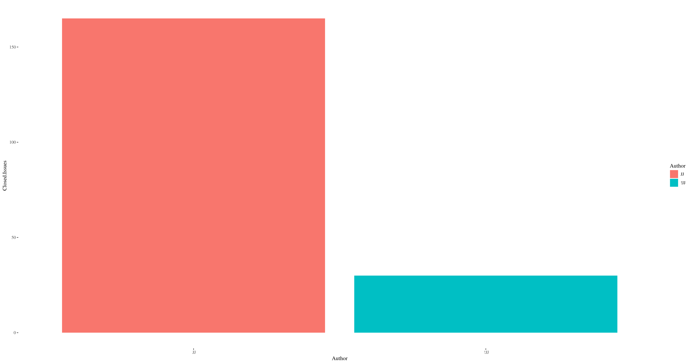
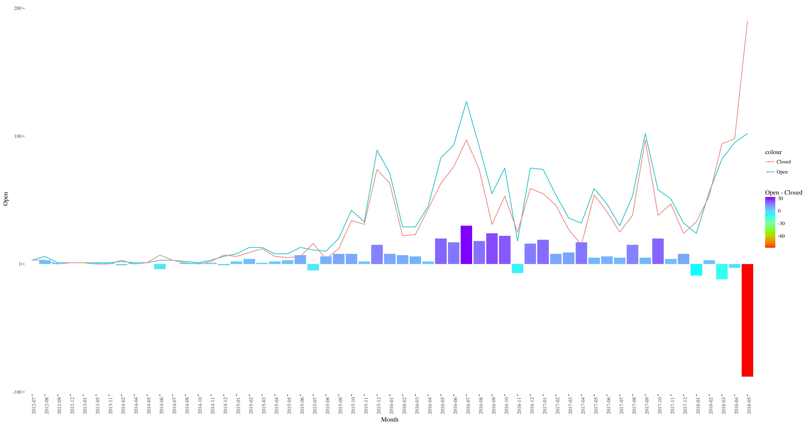
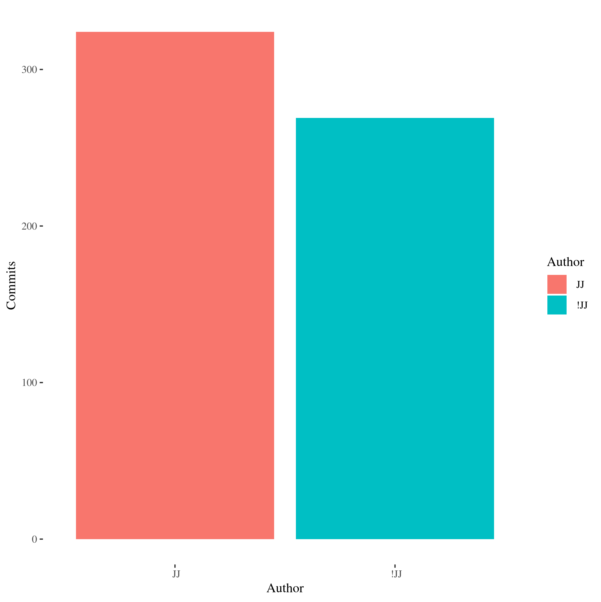

# May, 2018. Second month of the grant.

We will set as the official beginning of the grant April 1st, 2018,
which was a Sunday. The *official* end was, then, May 31st, a Thursday.

Here's the report on the activities carried out during the month of May.

## Issues closed

[Here's the table of issues closed during May](/report/issues-May-2018.md). Some
of them, the oldest ones, include some
comments. The
[April report has been updated](/report/issues-April-2018.md); there
was a bug in the `glob` implementation and prevented it from working.

Using the Perl 6 scripts included in this repo, I have closed more than 80
issues during April:

I eventually erased the `JJ TPF grant` label since it seemed to be
discouraging people from working themselves on the issues. I just
organized myself to close at least two issues per day, as was my
initial compromise.

In fact, those issues are, on average, more than 7 month old, or more
than 210 days, while the average for the rest of the contributors is a
bit more than ~1 month. 

> And that's mainly due to the fact
> that [issue #114](https://github.com/perl6/doc/issues/114), which was
> 1000 days old, was closed by someone else, although I did most of
> the commits to close it by creating several new pages that were
> missing from the roadmap since the very beginning.

That means that many of the issues addressed were part of the
backlog that was accumulation, and weren't, in fact, being addressed,
making the number of issues accumulate to the tune of a few tens every
month. If we look at the general 

In fact, this has allowed to buck the trend that pushed the number of
unsolved issues upward, and in fact has meant the biggest monthly
difference between the number of open and closed issues, as can be
seen below.

In fact, this high number of closed issues has allowed finally to
bring the total number of issues below 175 at the beginning of
June. This is now
the
[ranking of Perl6/doc issue closer](https://jj.github.io/TPF-Grant/illos/closers-perl6-doc-ranking/),
where I'm tied with the top closer.

## Contributions via commits

Last month I contributed more commits than the rest of the authors put
together, and in fact May was the month with the highest number of
commits so far in the Perl 6 repository.

Quite a few of those commits were done as part of
the
[May Squashathon](https://gist.github.com/Whateverable/11966854630519253293585849bb5d91). I
organized, as indicated in the grant proposal,
a [small Squashathon](http://granada.pm/blog/squashathon/) in which
several local developers participated, working on things like the
translation of README.md to several languages. I
also
[created this Howto](https://dev.to/jj/squashing-perl-6-documentation-bugs-one-at-a-time-4ojn) to
make easier the participation in the hackathon.

All in all, contributions via commits for the two months have been
this

| Month | My contributions | Total |
| ----- | ---------------- | ----- |
| April | 195              | 410   |
| May   | 324              | 593   |

## Other contributions

  
* [Contributions to StackOverflow](https://stackoverflow.com/questions/tagged/perl6),
  and encouragement of everyone (to the point of being annoying at
  times) to contribute their questions and answers there
  too. [StackOverflow](http://data.stackexchange.com/stackoverflow/query/847857/perl6-questions-per-month#graph) has
  seen the highest number of questions ever in May, after reaching the
  highest number in April.
  
*
  [The website has seen its highest number of unique visitors in March, April and May](http://www.p6c.org/stats/doc.perl6.org#Unique%20visitors%20in%20each%20month),
  with March being the highest.
  
## Conclusion

In general, these two months have been a lot of work, but I have had
lots of help in the #perl6 IRC channel, and the community has been
quite supportive. 

This month of May my intention was more to create new pages and
address really old issues, like #114. I have achieved that, with lot
of
work
[on creating pages on math and data structures from scratch](https://github.com/perl6/doc/issues/114). This
has completed the original roadmap of pages that needed to be created,
although
[the need to create new pages, like the one on statement prefixes](https://github.com/perl6/doc/issues/2034),
has emerged. 

I think that, after these two months of grant, I am in the position of
helping even better with the documentation repository, since I know
much better most or all outstanding issues and can help newcomers
focus on some new ones. After the grant, this is my intention for the
(near) future

* Present the work done here in upcoming Perl workshops.
* Try to close, at least, 1 issue a day, on a monthly basis. The
  incoming rate of new issues approximates that quantity. If it can be
  matched, the repository can progress in the bi-monthly hackathon.
* Continue encouraging the bimonthly document squashathon by focusing
  on single, and if possible easy, first issues.
* Continue encouraging participation in StackOverflow and checking
  posts for possible problems in the documentation.
* When `$day-job` allows, request another grant, possibly by the
  beginning of year 2019, to clear any backlog that might have
  accumulated or work
  in [really big issues](https://github.com/perl6/doc/labels/big),
  starting with the oldest ones.
* Continue publishing reports analyzing the documentation, and other,
  Perl 6 repositories and drawing conclusions from them.
  
# Some advice for Perl 6 documentation sustainability

Documenting a language is a lot of work; however, I expect to have
proved that a single, focused person is enough to clear the backlog of
issues and improve documentation in a way that volunteer work rarely
covers. [This report](https://www.researchgate.net/publication/325320277_Perl_6_documentation_repository_through_time_dealing_with_issues),
which studies issues, tends to show that volunteer work focuses on
short term, recent issues, disregarding other, more complicated issues
that require longer focus.

This is why a piece of advice is that the foundation, or someone in
overall charge of development, should create the figure of "designated
doccer", to be that figure that focuses on old, long-term issues that
require that kind of attention, as well as draw the focus of the
community to certain issues that might have been disregarded. Also use
higher level metrics,
like
[file entropy](https://www.researchgate.net/publication/325532706_Author_and_file_entropy_in_the_Perl_6_documentation_repository),
to find out which files have been disregarded and update or draw the
focus of the community to them.
It could
be a volunteer position or an honorary appointment, but it is
something that is really needed in this project.

